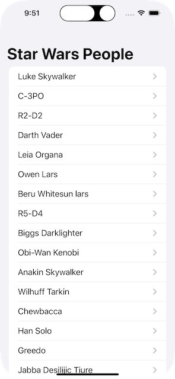
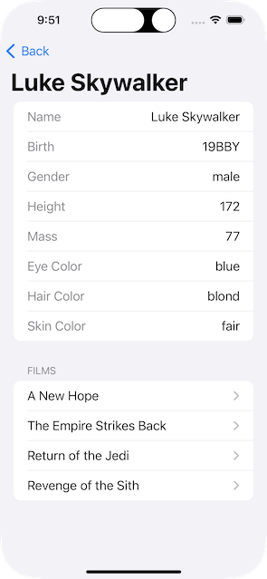
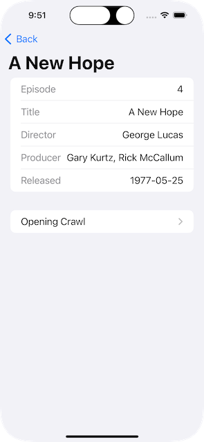
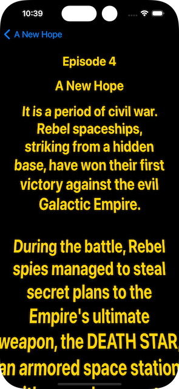

# Star Wars Universe Explorer

This is the Swift project we built during our **Swift Concurrency** workshop at [try! Swift World](https://www.tryswift.co/world/).

It's a SwiftUI app to explore the free data kindly provided by [The Star Wars API](https://swapi.dev).

You can step through our progress with each commit, tagged in git as follows:

- (tag: 1) Intial project with a `People` DTO.
- (tag: 2) Fetch a single "People" with `await`.
- (tag: 3) Generalize fetching with `URL` extension.
- (tag: 4) Generalize fetching with `Decodable` extension function.
- (tag: 5) Generalize fetching with async `init` in `Decodable` extension.
- (tag: 6) Handle HTTP error status codes.
- (tag: 7) Generalize with `URLRequest` extension. Add aggressive caching!
- (tag: 8) Add `PeoplePage` DTO. Fetch a page of people form API.
- (tag: 9) Fetch all pages from API in a loop.
- (tag: 10) Add a `People` detail view. Add a `Film` DTO.
- (tag: 11) Thought experiment with `async let`. Add snake case decoding.
- (tag: 12) Fetch all `Film`s with a task group.
- (tag: 13) Move extensions. Fetch all people pages in a background task.
- (tag: 14) Generalize fetching collections of `Decodable`s from collections of `URL`s.
- (tag: 15) Add mock JSON to previews. Add Film detail view.
- (tag: 16) Backport URLSession async method. Add README.
- (tag: 17) Add an opening crawl view.

